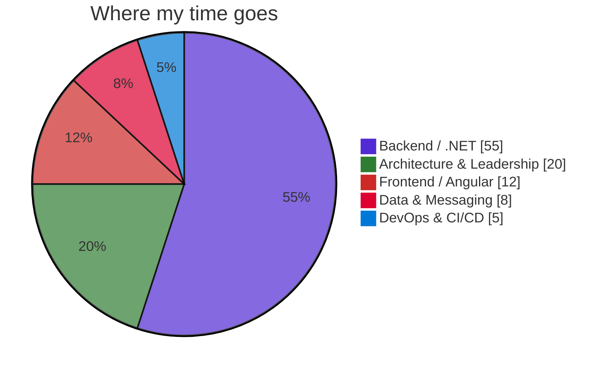

<!--
**ahmedfoad/ahmedfoad** is a ✨ special ✨ repository because its `README.md` (this file) appears on your GitHub profile.
-->

<h1 align="center">Hi 👋, I'm Ahmed Fouad</h1>
<h3 align="center">Senior .NET Engineer &nbsp;|&nbsp; Technical Lead &nbsp;·&nbsp; 14+ years shipping enterprise systems</h3>

  

  
  
  
  

---

### 🧑‍💻 About Me

- 🔭 &nbsp;Currently building core modules of the **Nusuk Umrah** national platform (Saudi government) at **NTG Clarity** — .NET 8, Clean Architecture, DDD, Camunda BPMN — serving **millions of pilgrims** annually
- 👥 &nbsp;I lead engineering teams of up to **8 engineers** and own delivery end-to-end
- 🏗️ &nbsp;Established **CI/CD, code review, and testing** practices from scratch across multiple teams
- 🌱 &nbsp;Deepening **microservices, event-driven architecture, and cloud-native .NET**
- 💬 &nbsp;Ask me about **ASP.NET Core, Clean Architecture, CQRS/MediatR, EF Core, and OAuth2/OIDC**
- 🌍 &nbsp;Based in **Cairo, Egypt** — open to senior .NET / technical lead roles across the Gulf
- ⚡ &nbsp;Fun fact: I once wired an HR system to fingerprint hardware for fully automated attendance & payroll

---

### 🛠️ Tech Stack

  

| Domain | Technologies |
| :--- | :--- |
| **Backend** |       |
| **Frontend** |      |
| **Architecture** |      |
| **Data & Messaging** |      |
| **Security** |     |
| **DevOps** |       |

---

### 💼 Career Highlights

| Role | Company | Period | Flagship Delivery |
| :--- | :--- | :--- | :--- |
| Senior Full Stack .NET Developer | **NTG Clarity** | Oct 2024 – Present | **Nusuk Umrah** portal — .NET 8, Camunda BPMN, 18 external integrations |
| Technical Lead (.NET / Angular) | **Depkey** | Feb 2024 – Sep 2024 | Full travel platform, 0 → prod in **8 months**, led team of **8** |
| Senior Full Stack Developer | **Banque Misr** | Jan 2023 – Jan 2024 | **Legal Pro** case-management for one of Egypt's largest banks |
| Senior Full Stack Developer | **Sales ARM (Dubai)** | Jul 2021 – Jan 2023 | **Digiteam** sales gamification platform (UAE & Egypt) |
| Software Engineer | **Echo Tech** | Jan 2021 – Jul 2021 | **SDMS** SIM-lifecycle system for Bahrain's telecom regulator |
| Senior .NET Developer & Team Lead | **Horan Al-Shamel (KSA)** | May 2014 – Jul 2020 | Saudi municipality systems — led team for **6+ years** |

---

### 📊 By the Numbers

  
  
  
  

---

### 📈 GitHub Stats

  
  &nbsp;
  

  

  

  

---

### 🎓 Education & Certifications

- 🎓 **B.Sc. Information Systems** — Faculty of Computers & Information, Helwan University (2010)
- 📜 **ALX Software Engineering Program** — in partnership with the Mastercard Foundation
- 📚 Continuing education: Clean Architecture, EF Core, unit testing, SignalR (Udemy)
- 🗣️ **Arabic** (native) · **English** (professional working proficiency)

---

  
  

<i>Thanks for stopping by — let's build something reliable. 🚀</i>

